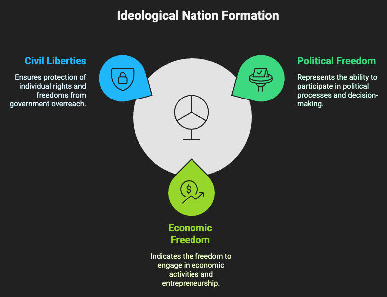
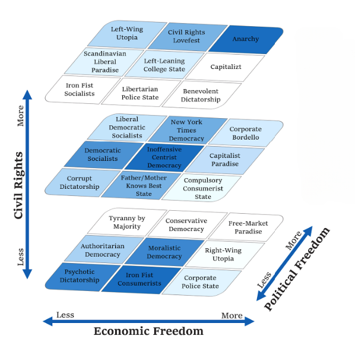
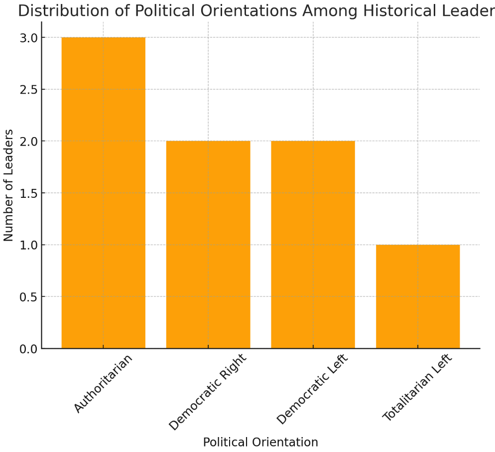

# Machina Imperium

A multiplayer nation simulation game where players compete against AI-controlled nations led by historical personalities. Each decision shapes your nation's future and influences potential alliances.

## Game Overview

In Machina Imperium, players create and manage their own nations while competing and potentially allying with AI-controlled nations led by historical figures. Make strategic decisions, form alliances, and compete for victory through economic dominance and diplomatic relations.




### Key Features

- Multiplayer gameplay with 2 human players
- AI-controlled nations with historical leader personalities
- Dynamic decision-making system
- Alliance formation based on national compatibility
- Ideology evolution based on decisions
- Statistical nation tracking and comparison

## Game Flow

1. **Game Creation**
   - Player 1 creates a game
   - Selects nation name and initial ideology
   - Makes decisions on various national issues
   - Receives a unique game ID

2. **Player 2 Joining**
   - Joins using the game ID
   - Creates their own nation
   - Makes national decisions
   
3. **AI Processing**
   - Historical AI leaders make decisions for their nations
   - Each AI personality influences decision-making
   - Nations evolve based on choices

4. **Alliance Formation**
   - AI nations analyze compatibility with human nations
   - Form alliances based on:
     - Economic Freedom alignment
     - Civil Rights compatibility
     - Political Freedom similarity
     - Overall ideology match

## AI Agents

### The Governor (governor.ts)
An AI agent responsible for nation management and decision-making.

**Features:**
- Makes decisions based on leader personality
- Considers nation's current metrics
- Evaluates options impact on:
  - Economic freedom
  - Civil rights
  - Political freedom
  - GDP

### The Diplomat (diplomat.ts)
An AI agent handling international relations and alliance formation.

**Features:**
- Analyzes nation compatibility
- Compares freedom metrics
- Forms alliances based on:
  - Statistical alignment
  - Ideological compatibility
  - National metrics

## Ideologies and Metrics



Nations are measured on three key metrics:
- **Economic Freedom** (0-100)
- **Civil Rights** (0-100)
- **Political Freedom** (0-100)

These metrics evolve based on decisions and determine the nation's governing ideology, ranging from "Psychotic Dictatorship" to "Anarchy" with 27 possible forms of government.

## Historical Leaders

The game features various historical personalities including:
- Genghis Khan (The Mongol Empire)
- Napoleon Bonaparte (Imperial France)
- Alexander the Great (Macedonian Empire)
- Winston Churchill (British Empire)
- Nelson Mandela (New South Africa)
- Margaret Thatcher (Neo-Britain)
- Joseph Stalin (Soviet Union)
- Jawaharlal Nehru (Modern India)

Each leader has unique attributes affecting their decision-making:
- Progressiveness
- Authoritarianism
- Pragmatism
- Economic Focus
- Visionary Thinking
- Flexibility
- Loyalty

## Leader Political Balance

The game features historical personalities who shape AI-controlled nations. These leaders span a range of political ideologies, influencing decision-making, alliances, and governance styles.

### Political Spectrum Distribution

* Authoritarian Leaders (Strong centralized rule, expansionist tendencies)
    * Genghis Khan (Mongol Empire)
    * Napoleon Bonaparte (Imperial France)
    * Alexander the Great (Macedonian Empire)

* Democratic Right Leaders (Free-market, conservative values)
    * Winston Churchill (British Empire)
    * Margaret Thatcher (Neo-Britain)
    
* Democratic Left Leaders (Social justice, state-influenced economies)
    * Nelson Mandela (New South Africa)
    * Jawaharlal Nehru (Modern India)

* Totalitarian Left Leaders (State-controlled economy, authoritarian governance)
  * Joseph Stalin (Soviet Union)



## Game States

The game progresses through various states:
1. `created` - Initial game creation
2. `player1_completed` - First player finished
3. `player2_completed` - Second player finished
4. `ready` - Ready for AI processing
5. `processing` - AI nations making decisions
6. `ready_for_processing_alliance` - Ready for alliance formation

## Technical Implementation

Built using:
- TypeScript
- LangChain for AI decision-making
- Zod for type validation
- OpenAI's GPT for AI personality simulation

## Command Menu Options

1. Create new game
2. Join existing game
3. List active games
4. Process the Game (AI decisions)
5. Show Nation Decisions
6. Process Alliances
7. Exit

# **How Countries Are Put into Ideological Buckets Using 1-NN**  

We use **1-Nearest Neighbor (1-NN)**, a simple machine-learning method, to classify countries into ideological groups based on three freedoms:  

1. **Economic Freedom** (how free the market is)  
2. **Civil Rights** (how much personal freedom people have)  
3. **Political Freedom** (how fair and open the government is)  

Each country is represented as a **point in 3D space**, with coordinates:  
```
(Economic Freedom, Civil Rights, Political Freedom)
```

---

## **Step-by-Step Process**  

### **1. Measure Distance**  
   - We calculate the **Euclidean distance** between a new country and all known countries:  
   ```
   d(A, B) = sqrt((E_A - E_B)^2 + (C_A - C_B)^2 + (P_A - P_B)^2)
   ```  
   - This tells us which country is the **most similar** in terms of freedom.

### **2. Find the Nearest Neighbor**  
   - The country that is **closest** in this 3D space is chosen as the **best match**.

### **3. Assign the Ideological Bucket**  
   - The new country is placed into the **same bucket** as its nearest neighbor.  

---

## **Example**  

- A new country has scores **(7, 5, 6)**.  
- We check the distance to all known countries.  
- The closest country is in the "Social Democracy" bucket.  
- So, the new country is classified as a **Social Democracy** too.

---


## Getting Started

```bash
npm install
npm run dev
```

Follow the on-screen prompts to create or join a game.