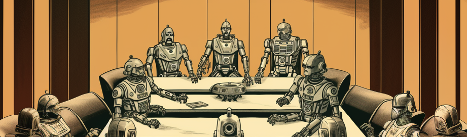
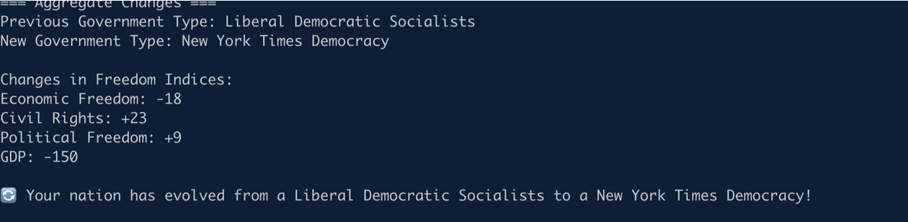
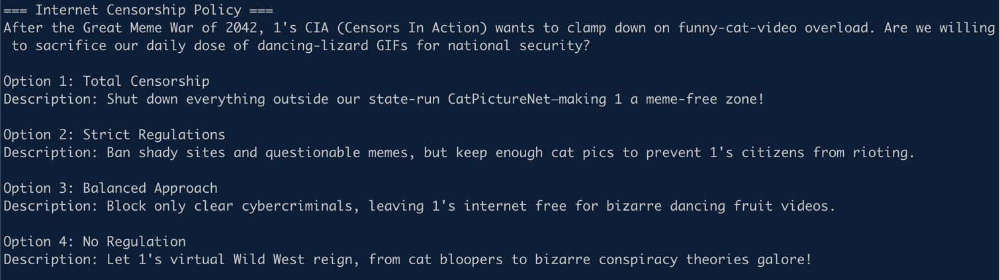
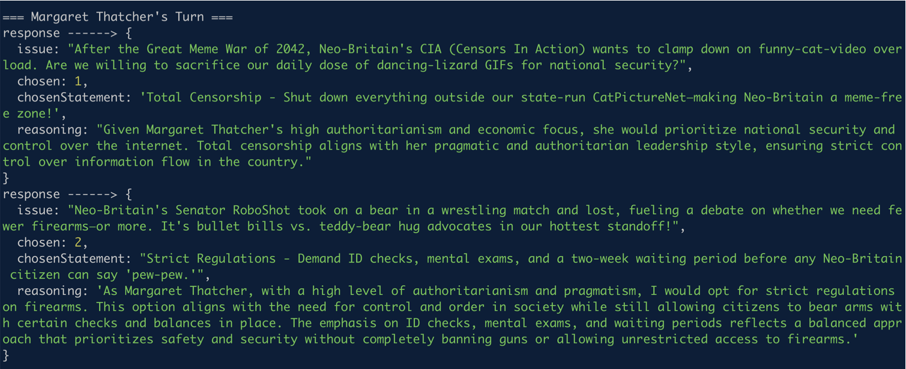
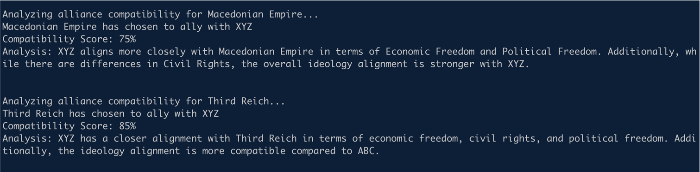

# Machina Imperium

A multiplayer nation simulation game inspired by *NationStates*, where players create nations aligned with their political ideals and compete against AI-controlled nations led by historical personalities. Every decision shapes your nation's future, influencing alliances and economic growth. As a PvP experience, nations strive to achieve the highest GDP while forging strategic partnerships with AI-driven nations. 
  
This game serves as an experiment in human-in-the-loop agentic gameplay and autonomous agent-to-agent interactions, where emergent narratives unfold through dynamic decision-making.  

Both human and AI-led nations must navigate complex socio-political and economic dilemmas, shaping their national policies over time. Decisions impact a nation's **political freedom, economic freedom, and civil liberties**, gradually shifting its dominant ideology. As nations react to evolving internal and external pressures, they may transform from capitalist democracies to totalitarian regimes—or vice versa.  



---

## Example Issue of the Game:  



Which option will your nation choose?  


## Game Flow

1. **Game Creation**
   - Player 1 creates a game
   - Selects nation name and initial ideology
   - Makes decisions on various national issues
   - Receives a unique game ID

2. **Player 2 Joining**
   - Joins using the game ID
   - Creates their own nation
   - Makes national decisions
   
3. **AI Processing**
   - Historical AI leaders make decisions for their nations
   - Each AI personality influences decision-making
   - Nations evolve based on choices

4. **Alliance Formation**
   - AI nations analyze compatibility with human nations
   - Form alliances based on:
     - Economic Freedom alignment
     - Civil Rights compatibility
     - Political Freedom similarity
     - Overall ideology match

5. **Winner Calculations**
   - Higher GDP = 20 points
   - Per Allied AI Nation = 10 Oints
   - Player with highest points win!   

## What does the agents do in the game? (for now)

### The Governor (agents/governor.ts)
An AI agent responsible for nation management and decision-making.




### The Diplomat (agents/diplomat.ts)
An AI agent handling international relations and alliance formation.



### The Historian (agents/historian.ts)
An AI agent that chronicles the journey of a nation.


## Ideologies and Metrics


Nations are measured on three key metrics:
- **Economic Freedom** (0-100)
- **Civil Rights** (0-100)
- **Political Freedom** (0-100)

These metrics evolve based on decisions and determine the nation's governing ideology, ranging from "Psychotic Dictatorship" to "Anarchy" with 27 possible forms of government.

## **How Countries Are Put into Ideological Buckets Using 1-NN**  

We use **1-Nearest Neighbor (1-NN)**, a simplified KNN, to classify countries into ideological groups based on three freedoms:  

1. **Economic Freedom** (how free the market is)  
2. **Civil Rights** (how much personal freedom people have)  
3. **Political Freedom** (how fair and open the government is)  

Each country is represented as a **point in 3D space**, with coordinates:  
```
(Economic Freedom, Civil Rights, Political Freedom)
```

---

## **Step-by-Step Process**  

### **1. Measure Distance**  
   - We calculate the **Euclidean distance** between a new country and all known countries:  

$$
d = \sqrt{(x_2 - x_1)^2 + (y_2 - y_1)^2 + + (z_2 - z_1)^2}
$$
   
   - This tells us which country is the **most similar** in terms of freedom.

### **2. Find the Nearest Neighbor**  
   - The country that is **closest** in this 3D space is chosen as the **best match**.

### **3. Assign the Ideological Bucket**  
   - The new country is placed into the **same bucket** as its nearest neighbor.  


### **Example**  

- A new country has scores **(7, 5, 6)**.  
- We check the distance to all known countries.  
- The closest country is in the "Social Democracy" bucket.  
- So, the new country is classified as a **Social Democracy** too.

## Historical Leaders

The game features various historical personalities including:
- Genghis Khan (The Mongol Empire)
- Napoleon Bonaparte (Imperial France)
- Alexander the Great (Macedonian Empire)
- Winston Churchill (British Empire)
- Nelson Mandela (New South Africa)
- Margaret Thatcher (Neo-Britain)
- Joseph Stalin (Soviet Union)
- Jawaharlal Nehru (Modern India)

Each leader has unique attributes affecting their decision-making:
- Progressiveness
- Authoritarianism
- Pragmatism
- Economic Focus
- Visionary Thinking
- Flexibility
- Loyalty


### Political Spectrum Distribution

* Authoritarian Leaders (Strong centralized rule, expansionist tendencies)
    * Genghis Khan (Mongol Empire)
    * Napoleon Bonaparte (Imperial France)
    * Alexander the Great (Macedonian Empire)

* Democratic Right Leaders (Free-market, conservative values)
    * Winston Churchill (British Empire)
    * Margaret Thatcher (Neo-Britain)
    
* Democratic Left Leaders (Social justice, state-influenced economies)
    * Nelson Mandela (New South Africa)
    * Jawaharlal Nehru (Modern India)

* Totalitarian Left Leaders (State-controlled economy, authoritarian governance)
  * Joseph Stalin (Soviet Union)


---

## Getting Started

```bash
npm install
npm run dev
```

Follow the on-screen prompts to create or join a game.

## Smart Contracts 
Ethereum Sepolia - 0x30CCF5C0Ea4F871398136DD643A0544Aba39b26D
Verified Link - https://sepolia.etherscan.io/address/0x30ccf5c0ea4f871398136dd643a0544aba39b26d

Base Sepolia - 


